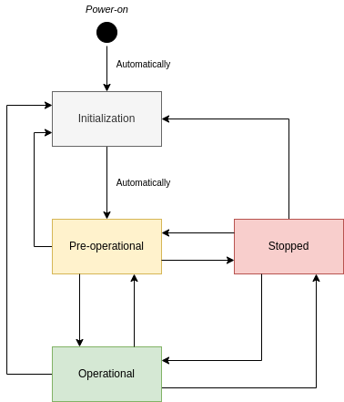
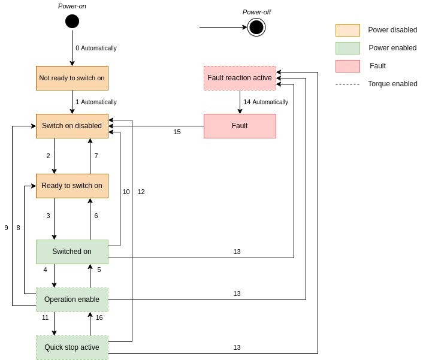

# motor402
### An implementation of a CANopen device profile for drives and motion control according to CiA 402®

This library depends on the *CANopen for Python* implementation of the CANopen standard, mainly to provide NMT and SDO support (probably PDO in the near future). [[1]](#1)

### What is CANopen?

CANopen is a CAN-based communication system. It comprises higher-layer protocols and profile specifications. CANopen has been developed as a standardized embedded network with highly flexible configuration capabilities. It was designed originally for motion-oriented machine control systems, such as handling systems. Today it is used in various application fields, such as medical equipment, off-road vehicles, maritime electronics, railway applications, or building automation. [[2]](#2)

### CiA 301

CiA 301 specifies the CANopen application layer. This includes the data types, encoding rules and object dictionary objects as well as the CANopen communication services and protocols.

It also specifies the network management services (NMT).
The NMT follows a master-slave architecture. Most devices are regarded as NMT slaves and are identified by their node ID (1-127).

    
    
Figure 1. NMT Finite State Automaton

### CiA 402

The CAN in Automation 402 is a profile which **defines specifications for devices able to be digitally controlled**, such as stepper motors, frequency converters and servo motors.

It includes a FSA (Figure 2) that defines the device behavior for each state, determining the available commands and wether the power is enabled or not.

    
    
Figure 2. CiA402 Finite State Automaton

Although CiA402 is a well-specified set of motion control profiles, the manufacturer-specific functions and parameters (or lack thereof) *heavily* limit the exchangeability of compliant devices. [[3]](#3)

## References

<a id="1">[1]</a>  [CANopen for Python](https://github.com/christiansandberg/canopen)

<a id="2">[2]</a>  [CANopen – The standardized embedded network](https://www.can-cia.org/canopen)

<a id="3">[3]</a>  [CiA® 402 series: CANopen device profile for drives and motion control](https://www.can-cia.org/can-knowledge/canopen/cia402)

